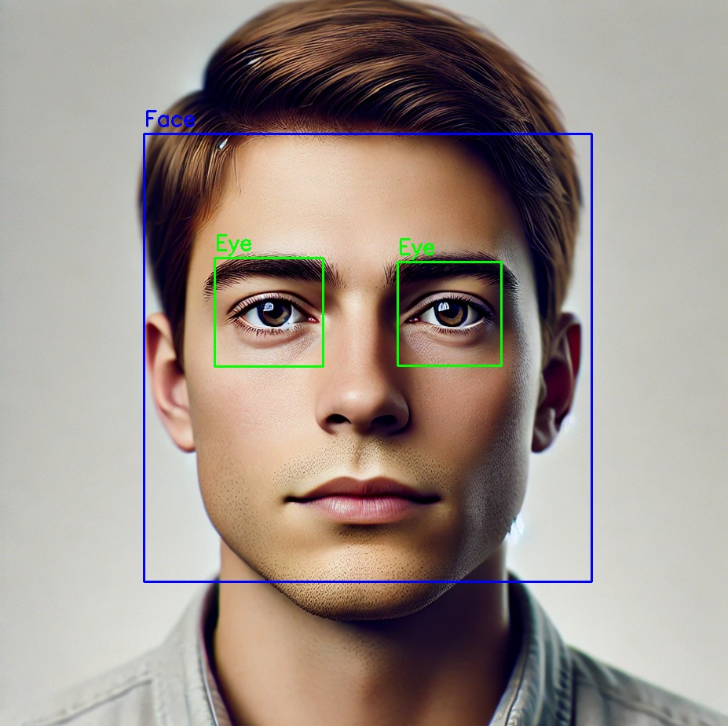
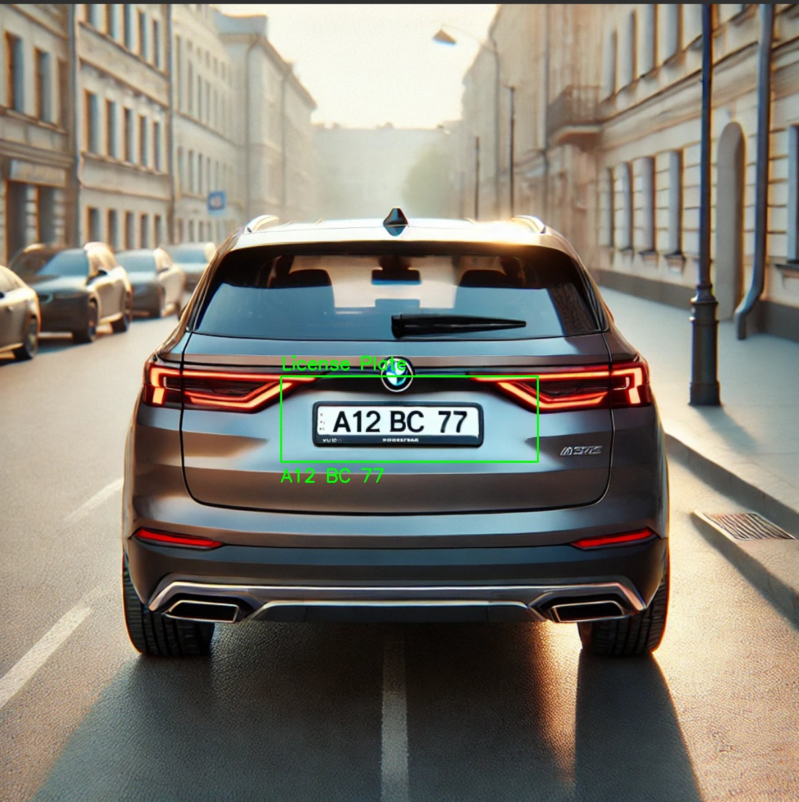
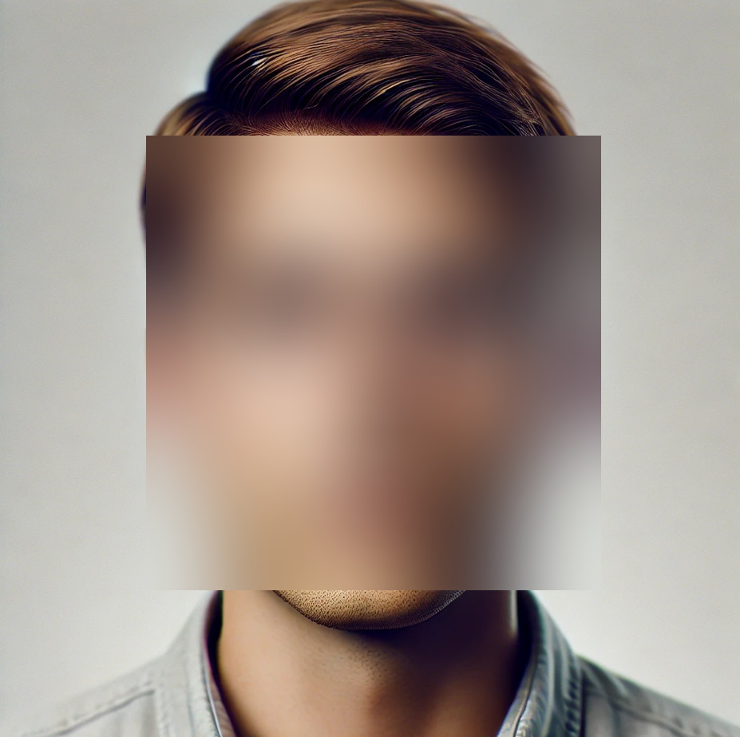
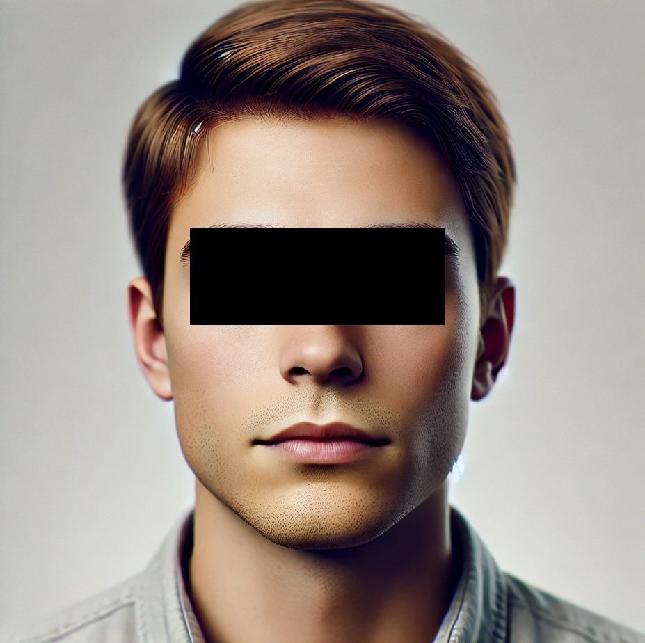

# Face and License Plate Detection in Images

This project detects **faces**, **eyes**, and **license plates** in an image using Haar cascades and optionally applies **blurring** or **black bar masking**. It also uses **EasyOCR** to extract and display text from license plates.

## Project Structure

- `main.py`: Entry point of the program. Parses arguments, validates input, and calls the detection pipeline.
- `image_detection.py`: Contains the full image processing pipeline, including:
  - Haar cascade detection for faces, eyes, and license plates
  - Optional blurring or masking
  - OCR-based text extraction from license plates

## Detection Features

The following features are implemented in `image_detection.py`:

- **Face Detection**: Detects faces using OpenCV's pre-trained Haar cascade and optionally:
  - Blurs the entire face region.
  - Adds a black bar over detected eyes for anonymization.

- **License Plate Detection**: Uses a Haar cascade to detect license plates and optionally:
  - Blurs the plate.
  - Adds a black rectangle over the plate.
  - Uses **EasyOCR** to extract and display license plate text.

- **Eye Detection**: Localizes eyes within detected faces for targeted masking.

## How to Run

1. Clone the repository to your local machine.
2. Install the required dependencies:
```bash
pip install opencv-python easyocr matplotlib
```
3. Run the main script:
```bash
python main.py -i path/to/image.jpg --edit blur --save
```

### Command-line Arguments

- `-i, --input`: **(Required)** Path to the input image file (supports `.jpg`, `.jpeg`, `.png`).
- `-e, --edit`: **(Optional)** Choose between:
  - `blur`: Blurs detected faces and license plates.
  - `black`: Masks eyes and license plates with black rectangles.
  - *(default)*: Draws detection boxes with labels.
- `-s, --save`: **(Optional)** Save the processed image as `processed_image.jpg`.

### Example Commands

#### Basic Detection
```bash
python main.py -i samples/face.jpg
```

#### Blur All Sensitive Info
```bash
python main.py -i samples/car.png --edit blur -s
```

#### Add Black Bars
```bash
python main.py -i samples/face.jpg -e black
```

## Example Outputs

After running the script, the image will be displayed with the detected features annotated or obscured depending on the mode selected.

>*Note: The images in the samples were created by AI using prompts:*
> - Generate me a human portrait.
> - Generate me a car with a license plate.

#### Detection Mode



#### License Plate Mode



#### Blur Mode



#### Black Mask Mode



## License

This project is licensed under the MIT License. See the [LICENSE](LICENSE) file for details.

## Acknowledgments

- Face, eye, and plate detection powered by OpenCV Haar cascades.
- OCR functionality provided by [EasyOCR](https://github.com/JaidedAI/EasyOCR).
